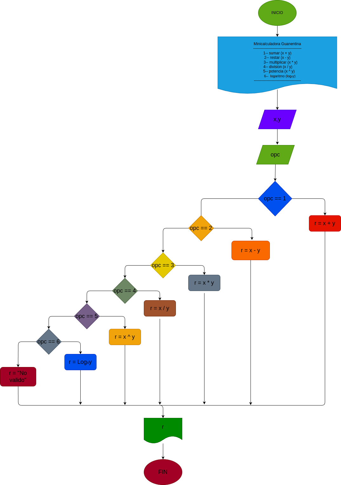

# Mini_Calculadora_Guanentina

### Anàlisis

### input
x: Primer nùmero de la operaciòn.

y: Segundo nùmero de la operaciòn.

opc: Nùmero correspondiente a las diferentes operaciones posibles.

### processing 

opc: Determina la operaciòn al realizar.

Operaciones disponibles:

1) Suma: r = x + y

2) Resta: x - y

3) Multiplicaciòn: x * y

4) Divisiòn: r = x / y

5) Potencia r = x^y

6) Logaritmo: r = log base y de x

Si opc no es vàlido, el resultado serà "No vàlido".

### output 
r: Resultado de la operaciòn seleccionada.

# Diseño

 
# Construcciòn
 